# Teardown & Signal Analysis — Commercial Mole Repellers

## Overview

Two commercially available solar mole repellers were purchased, disassembled, and analysed
using a PicoScope 4423 oscilloscope to measure the actual vibration motor output signal.
The goal was to establish a measured baseline of what current products actually produce,
to justify the design decisions made in this next-generation device.

---

## Units Tested

| | BrightLife BL17 | Pest Protest (AR08) |
|---|---|---|
| **Solar panel** | 5V, 65mA | 4.5V, 45mA |
| **Battery** | 3.7V Li-ion, rechargeable | 3.7V / 200mAh Li-ion |
| **PCB revision** | AR08-M-V1.1 | AR08-M-V1.1 |
| **PCB manufacturer** | www.x-pest.com | www.x-pest.com |
| **Vibration modes** | 3 (cycles every 24h) | 3 |
| **Waterproofing** | IP65 (claimed) | Not specified |
| **Stake material** | ABS plastic, hollow | ABS plastic, hollow |

**Key finding:** Both products share the **identical OEM PCB** (AR08-M-V1.1 from x-pest.com),
despite being sold under different brand names at different price points. They are the same
device in different plastic shells.

---

## Teardown — What's Inside

### Photos

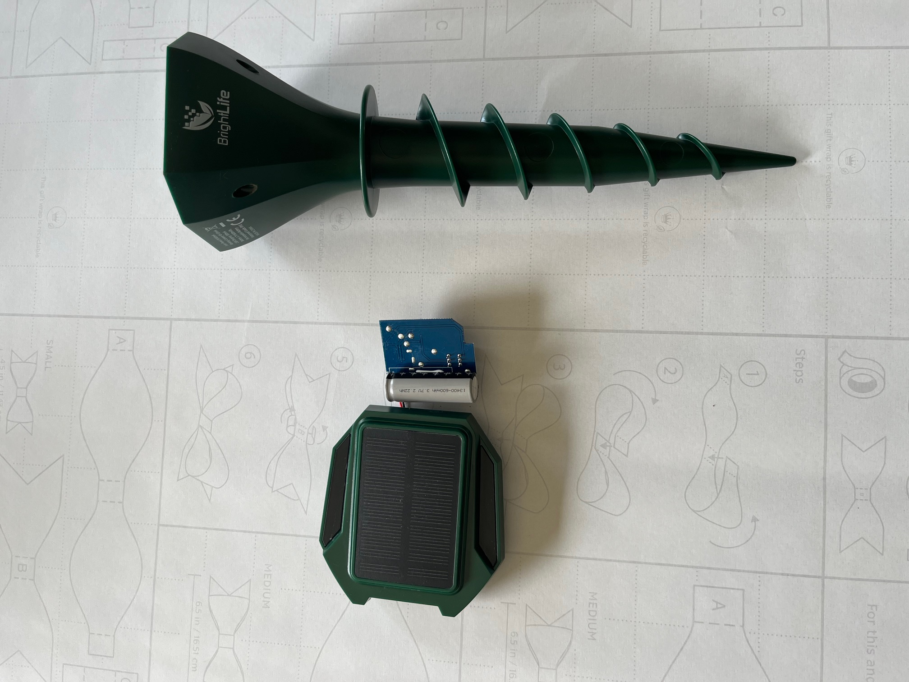
*Fig 1. BrightLife BL17 — complete unit with helical plastic ground spike.*

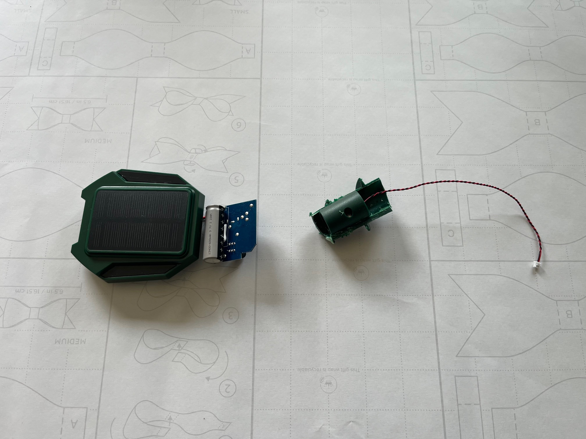
*Fig 2. Head unit disassembled — solar lid removed, PCB and vibration motor visible.*

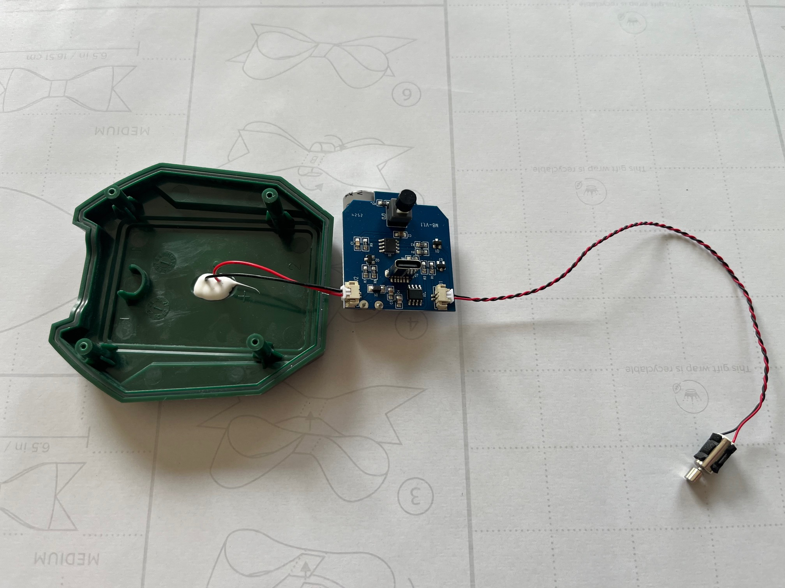
*Fig 3. PCB top — solar input (S+), battery connector (B+/GND), motor connector (M+),
on/off switch (SW1), and single 8-pin IC (timer/driver).*

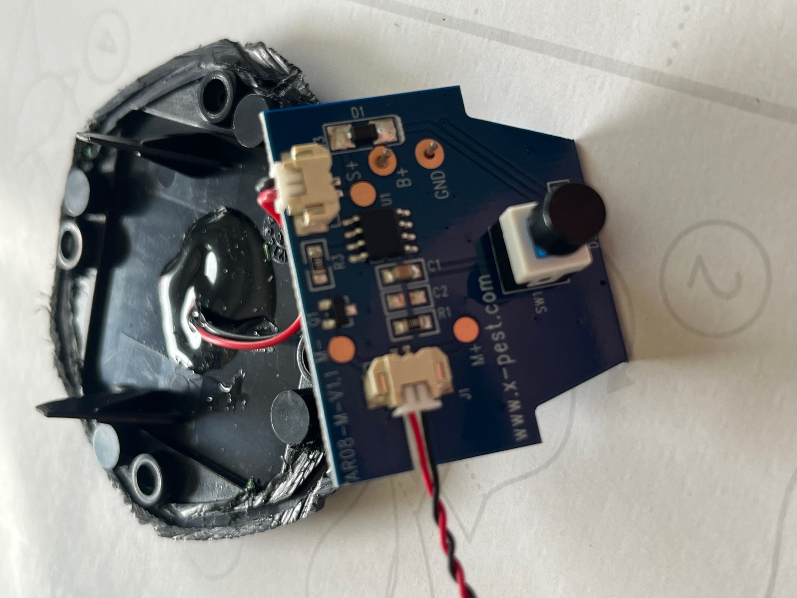
*Fig 4. PCB close-up — AR08-M-V1.1, www.x-pest.com. Board controls one small vibration
motor only. No speaker, no audio output, no frequency control.*

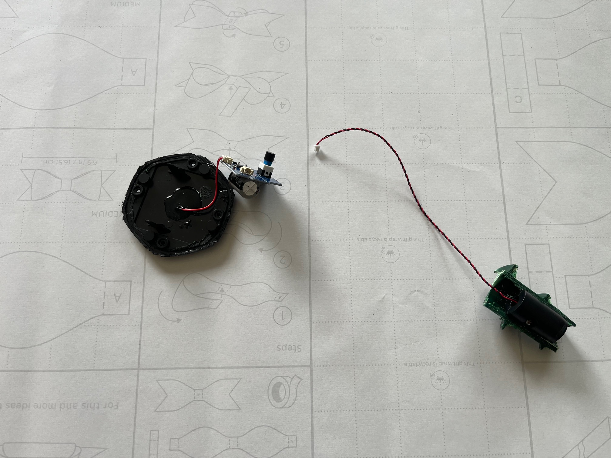
*Fig 5. Vibration motor — 4mm diameter coreless cylinder motor with off-centre brass weight.
This is the smallest class of commercial vibration motor; used in old mobile phones as a
haptic actuator. Mass of eccentric weight: < 0.5g.*

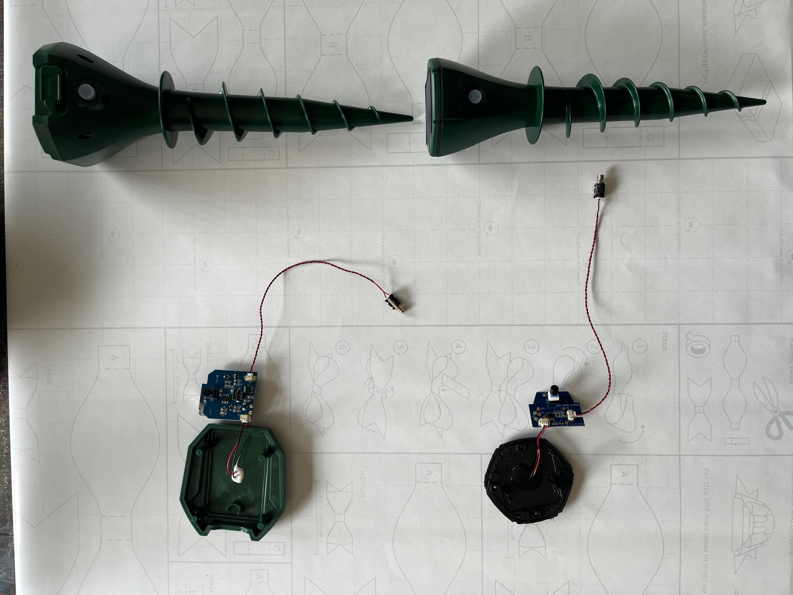
*Fig 6. Both BrightLife (green, left) and Pest Protest (black, right) disassembled side by
side. Identical PCB, identical motor, different enclosure only.*

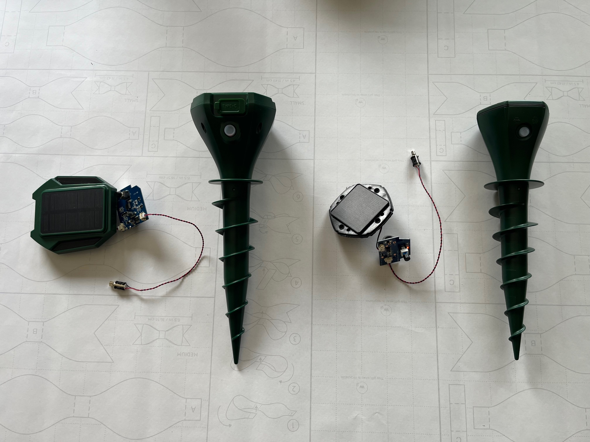
*Fig 7. Both units fully laid out — heads, stakes, PCBs and motors separated.*

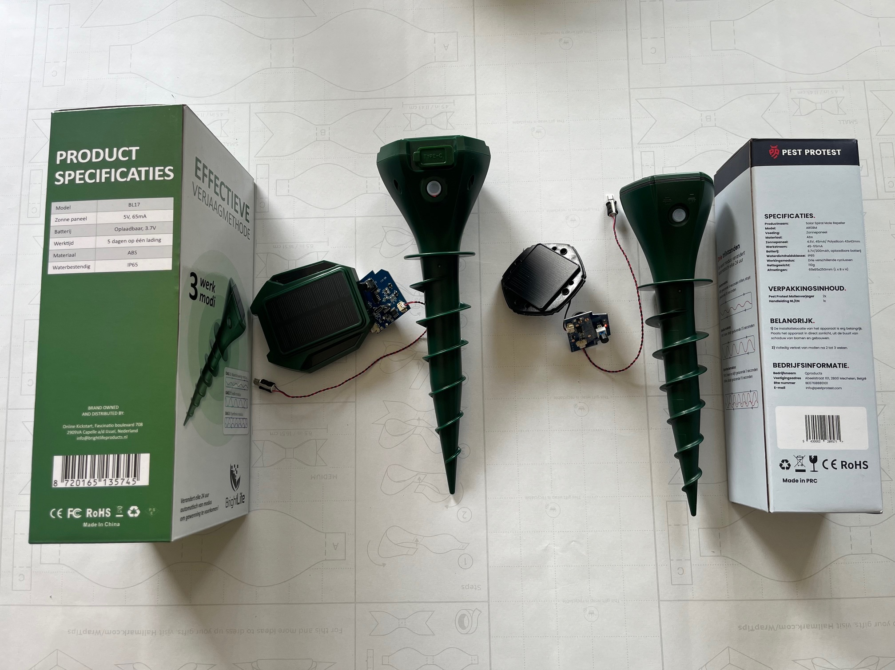
*Fig 8. Both units next to retail packaging showing product specifications.*

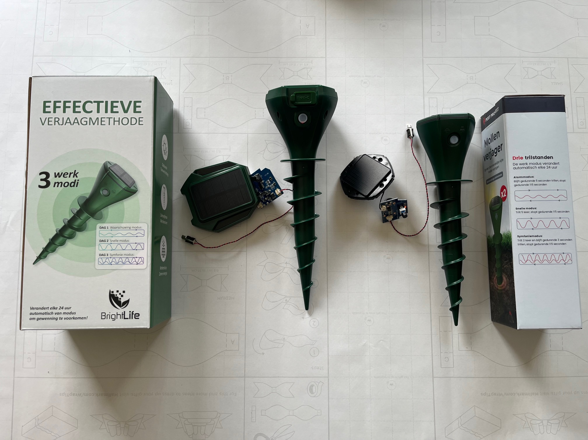
*Fig 9. Both boxes front view. BrightLife claims "3 werk modi" changing every 24 hours.
Pest Protest claims "Drie trilstanden". Both are the same 3 fixed patterns from identical OEM firmware.*


*Fig 10. x-pest.com — the OEM manufacturer behind both products. Same PCB, same firmware,
sold to multiple brands.*

---

## PicoScope Signal Analysis

**Equipment:** PicoScope 4423, 20MHz, 80MS/s  
**Measurement:** DC voltage across vibration motor terminals  
**Scale:** ±5V, 10 s/div  
**Sample rate:** 1 MS/s

### Test Setup

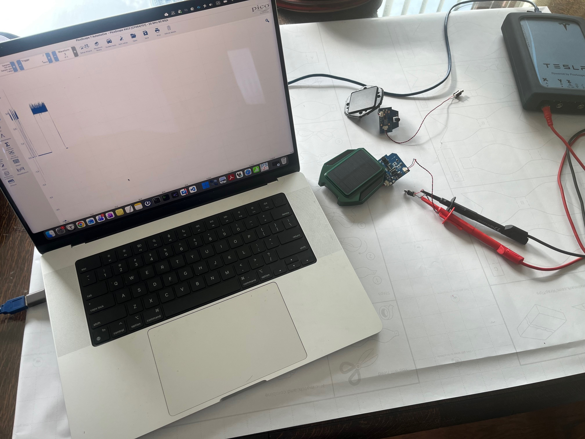
*Fig 8. Test setup — PicoScope probes connected directly to vibration motor terminals.
Unit powered from its own battery (3.7V Li-ion).*

---

### Finding 1 — Only 3 Fixed Vibration Patterns

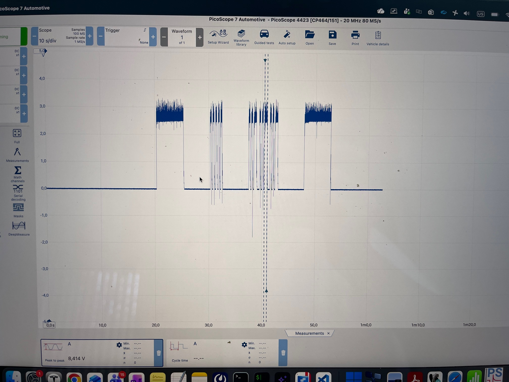
*Fig 9. Full capture at 10 s/div. Three distinct burst shapes are clearly visible repeating
in a fixed sequence. The pattern is perfectly predictable — no variation in timing,
frequency, or amplitude between cycles.*

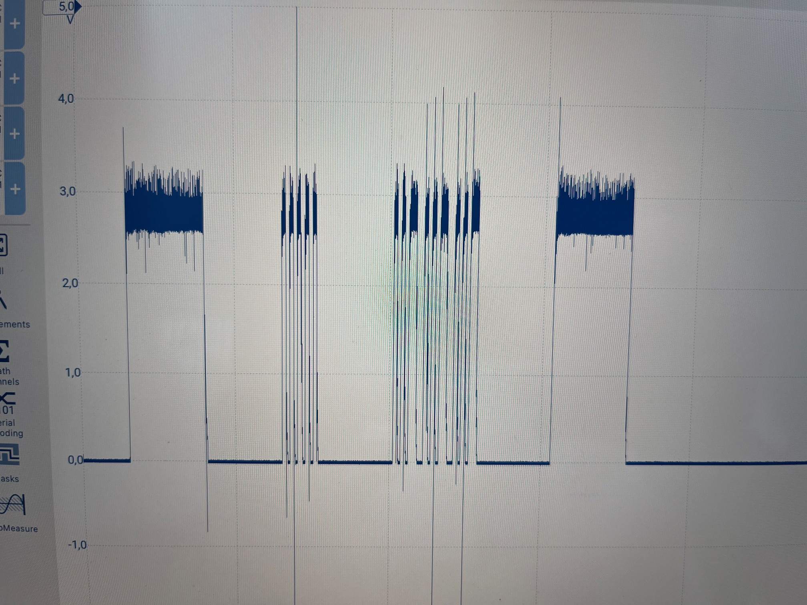
*Fig 10. Close-up showing the three pattern types side by side:*

The three patterns visible on the scope correspond exactly to the modes advertised on the box:

| Mode | Observed waveform | Duration | Off period |
|---|---|---|---|
| **Alarm** | Solid on-burst, full amplitude | ~5 s | ~115 s |
| **Fast** | Rapid on/off pulses, full amplitude | ~5 s | ~115 s |
| **Symphony** | Double-burst + rapid pulses sequence | ~3 s | ~115 s |

**All three modes use the same fixed timing, the same fixed amplitude, and the same fixed
pulse shapes on every single cycle.** The device rotates through these three modes once per
24 hours, meaning a mole is exposed to the same pattern for 24 hours straight before it changes.

---

### Finding 2 — Low Motor Voltage / Low Energy Output

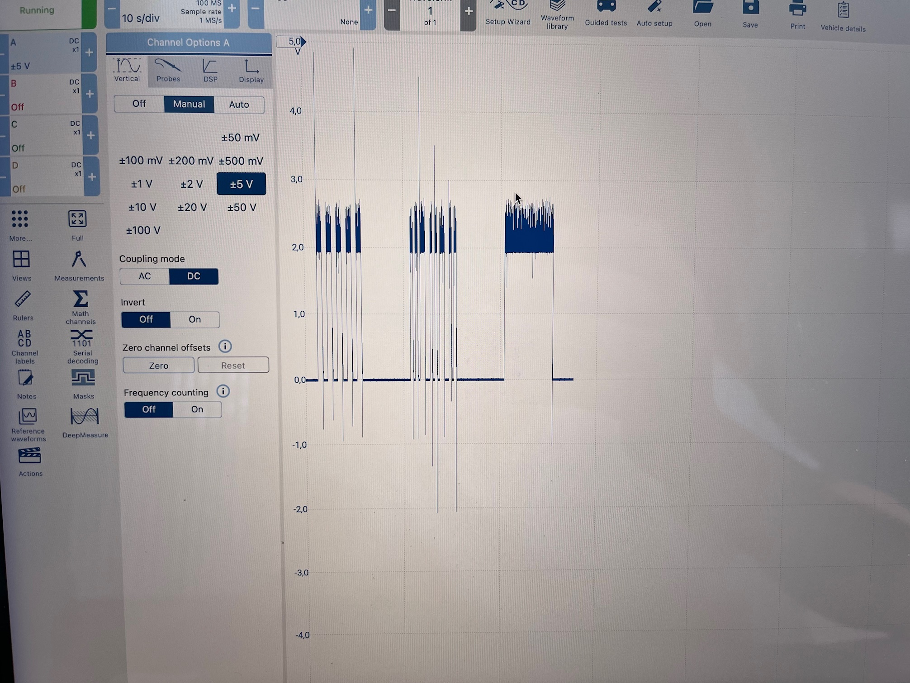
*Fig 11. PicoScope measurement panel — peak-to-peak voltage including back-EMF spike: **8.414V**.
The operating voltage of the motor is approximately **3.0–3.3V** (direct from Li-ion, no boost).*

**What the 8.414V peak-to-peak actually means:**

The high peak is not a high-energy drive signal — it is the **inductive back-EMF spike**
generated when the motor is switched off. The actual motor drive voltage is only ~3V:

```
  3.3V ┤▓▓▓▓▓▓▓▓▓▓▓▓▓▓▓▓▓▓▓▓┐ ← motor ON (~3.0–3.3V from Li-ion)
       │                     │
  0.0V ┤─────────────────────┘─────── ← motor OFF
       │
 -5.1V ┤  ↑ back-EMF spike only (~1 µs wide, no energy in it)
```

The motor is a **4mm coreless cylinder motor**, the same type used as a haptic buzzer in
early mobile phones. Its eccentric weight is less than 0.5g. This produces very limited
mechanical energy — barely perceptible on a hard surface, almost certainly negligible
when the device is inside a plastic stake buried in soil with poor acoustic coupling.

---

### Finding 3 — Fixed 115-Second Silent Window

Between every burst, the device is completely silent for approximately **115 seconds**.
This is a constant, unchanging interval visible in every cycle captured on the scope.

As discussed in [design-issues-traditional-repellers.md](design-issues-traditional-repellers.md),
a fixed silent window is the single most exploitable feature for a habituating animal.
After a few days a mole learns: "2 minutes of silence = safe to tunnel."

---

## Summary of Measured Deficiencies

| Issue | Measured value | Impact |
|---|---|---|
| Number of unique patterns | **3** (fixed, cycling every 24h) | Habituates within days |
| Silent interval | **~115 s fixed** | Mole learns safe window immediately |
| Motor drive voltage | **~3.0–3.3V** (no boost) | Low energy, especially after partial battery discharge |
| Motor type | **4mm coin/cylinder, < 0.5g weight** | Minimal ground coupling |
| Frequency content | **Broadband noise from uncontrolled motor** | No deliberate frequency targeting |
| Speaker / audio output | **None** | Single stimulus channel only |
| Ground coupling | **Hollow ABS plastic stake** | High impedance mismatch with soil |
| OEM sharing | **Same PCB in both products** | No independent R&D between brands |

---

## Conclusion

The measured output of both commercial units confirms every theoretical concern raised in
[design-issues-traditional-repellers.md](design-issues-traditional-repellers.md):

- **Fixed patterns** — 3 modes only, cycling every 24 hours
- **Fixed timing** — identical 115 s silent window every cycle
- **Low energy** — 3V drive into a sub-gram vibration motor in a hollow plastic stake
- **No audio component** — single-channel vibration stimulus only
- **No randomisation** — zero — the waveform is byte-for-byte identical every cycle

These findings directly motivate every design decision in this project:
randomised patterns, randomised timing, dual motor+speaker output, and proper
ground coupling via a metal stake.